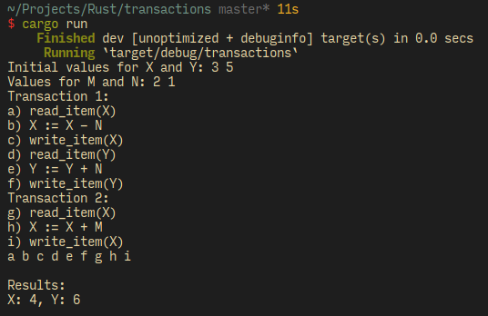

# Transaction Fixed Simulation

## Dependencies
- Rust Stable (1.26)
- Cargo

## How to compile
```
$ git clone https://github.com/lans98/transactions
$ cd transactions
$ cargo run
```

## Fixed transactions

| T1 |
|----|
|read_item(X)|
|X := X - N |
|write_item(X)|
|read_item(Y)|
|Y := Y + N |
|write_item(Y)|

| T2 |
|----|
|read_item(X)|
|X := X + M |
|write_item(X)|

## Basic usage
The program is very simple to use, at first it ask you to give
a value to `X, Y, M, N`, after that it shows you both fixed
transactions, every line has a character asociated `('a'..'i')`
input your custom order, wait for the results (e.g. `a b c d e
f g h i` will execute all orders secuetially)

## Results
Program will fail if there any data races, or multiple access
to the same variable at the same time, otherwise it will
succeed and show final values of `X, Y`

## Example

